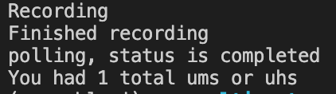

# speech-coach

AI-enabled speech coach

Your end goal is to write a "speech coach" - a Python program that will count the number of times someone says "uh" or "um" after they finish talking into their microphone. This starter code is missing functionality to actually transcribe the user's audio. That's what you'll be adding.

## Usage

To see how the app currently runs, do the following:

1. Create a fresh conda environment or virtualenv
2. Install `portaudio`. On Mac, do `brew install portaudio`
3. Pip install other requirements: `pip install -r requirements.txt`
4. Run `./record_audio.py`
5. Speak out loud for up to 3 seconds
6. Open the `output.wav` file that is produced

## Goal

When you finish, your final app should still record the user's audio, but it should print out the number of "um"s or "uh"s. Your terminal will look this:

